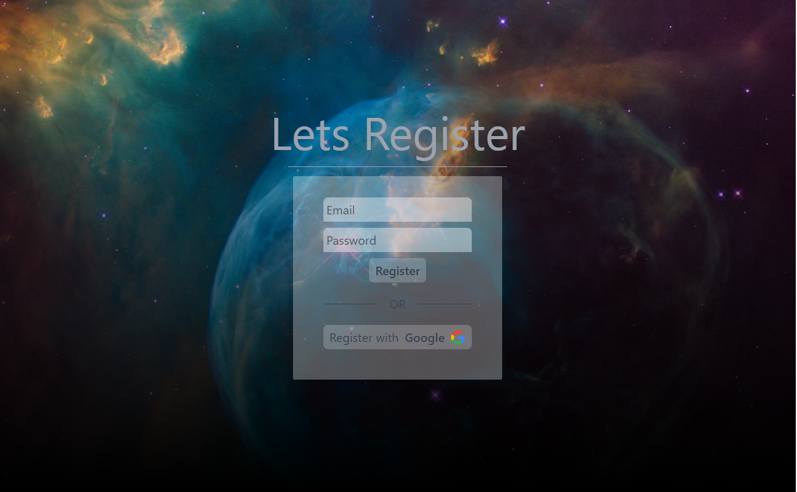
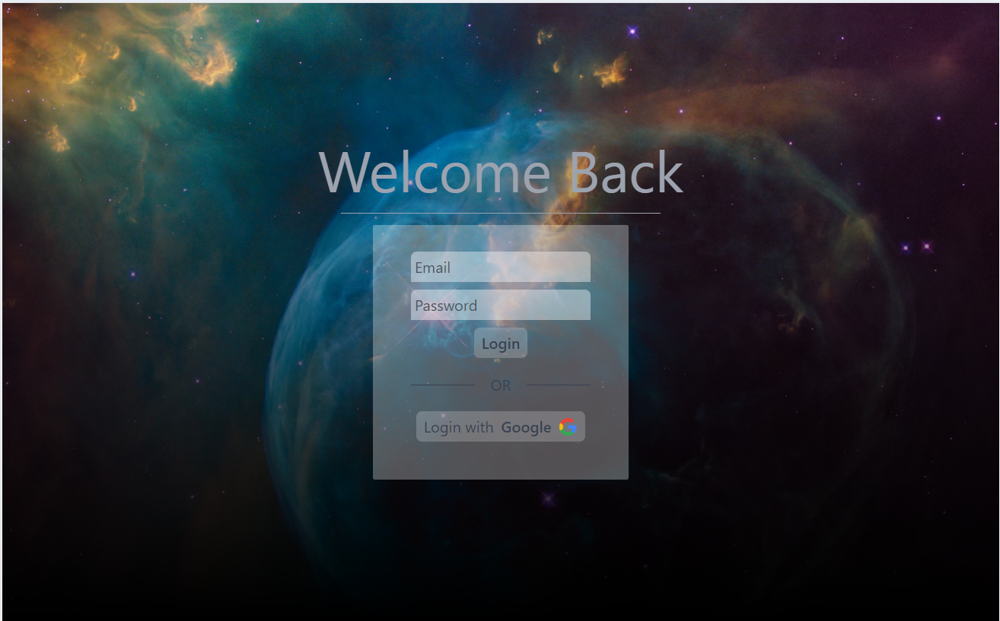

# :lock: Authentication template Express JS using Passport.js and Google OAuth2

---

This is a simple JS template project using Express JS and Passport.js.
As my transition to JavaScript is advancing so are the types of projects.Here i wanted to practice authentication
with local database and also with Oauth2.
My code is written modular now,as I advanced my Express.js knowledge.

---

## How to use?

- To use make sure to clone repository first using:

```bash
git clone <repistory_name> <folder_name>
```

- after cloning make sure to install dependecies using

```bash
npm i
```

- **Make sure to configure your own .env file like provided example**

- Start the server by running :

```bash
node ./app.js
```




